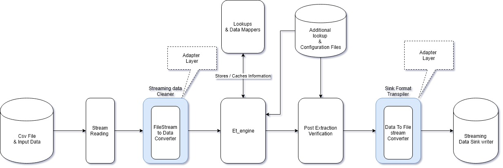
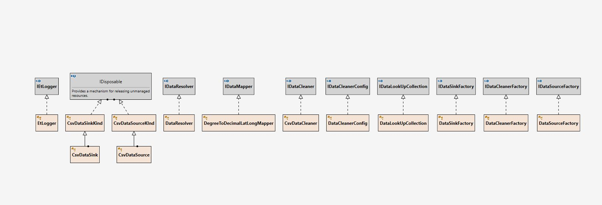

# Design of how this et_tool works
## Criteras kept on watch : 
1. Should be able to support large csv.
2. Should be able to support different sources of data
3. should be able to configure easly 

## 1. DataCleaner, DataResolver, DataSource & DataSink are decoupled from Engine's actual logic
This increases 
1. Testability 
2. Modularity 
3. Ease of maintanance
4. Extensibility

## 2. Path Build & Dynamic Extraction without writing queries helps in extensibility of csv & data

## Algorithm / Flow Description

1. Start
2. Read Settings & Runtime Confguration Information
3. Detect Output Settings From Template Description Json
4. Perform CSV Readability Analysis
   1. Check for Total Lines & Csv records parsed
   2. Check for DataAlignment
5. If Test Failed Try To Fix Alignment 
   1.  Currently Uses Basic Symbol omitting & UTF 8 Encoding to handle all data 
   2.  Can use Data Type Inference Based Algorithms to Help out
   3.  Test again for Issues
   4.  Get User Assist If Cleaning failed
       1.  Give proper insight to data & error
6. Stop if Auto Cleaning Failed
7. Perform Data Extraction path Building 
   1. Use Provided Data lookup & DataMappers to help out
8. Display Data fetching path
9. If Path Building is complete Proceed with Extraction else stop
10. Stream each line from input file
11. For each interested Output Column, Extract output data
12. Write Data to Output Sink
13. Once Finished , Do post run check
14. End 

## Design Diagram 

### Component Style 

### Module level Structuring

